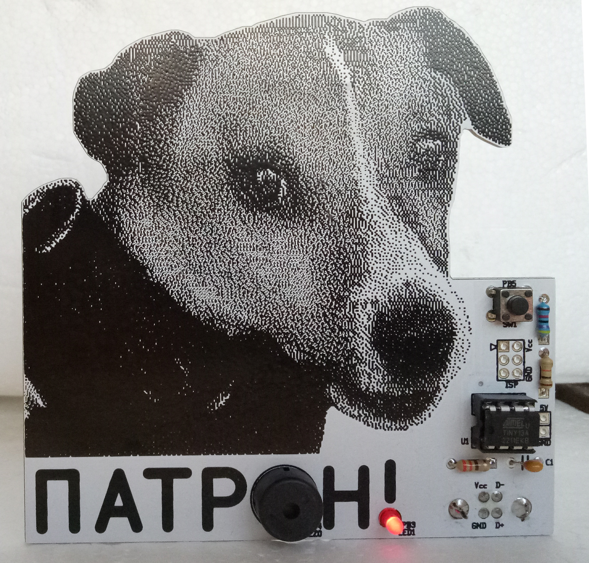
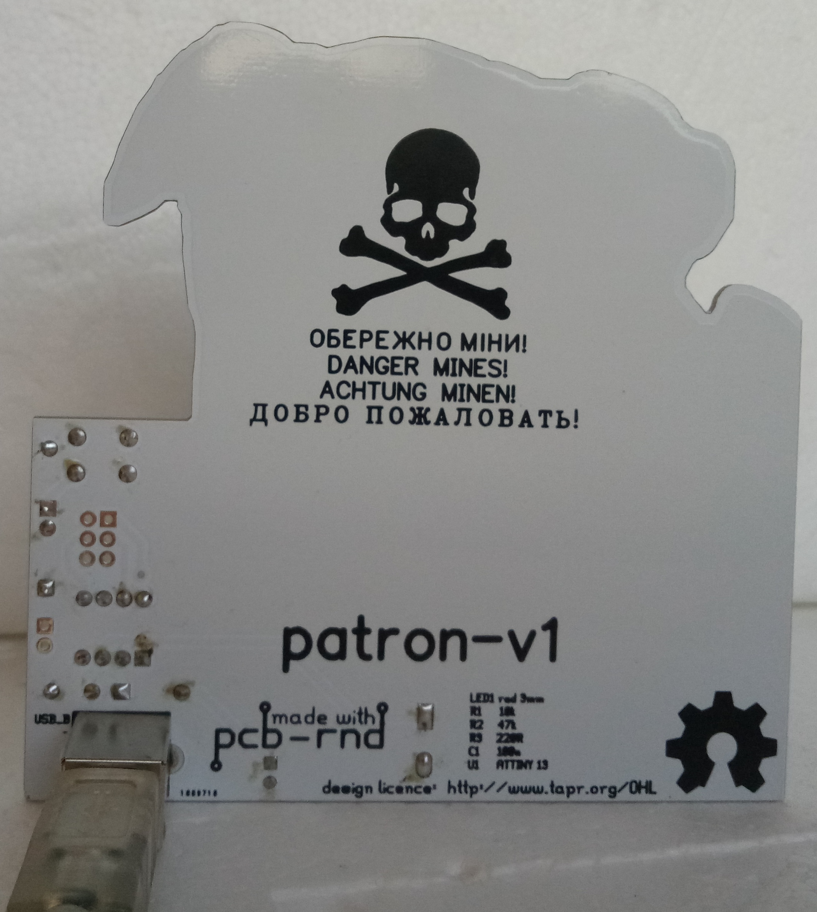
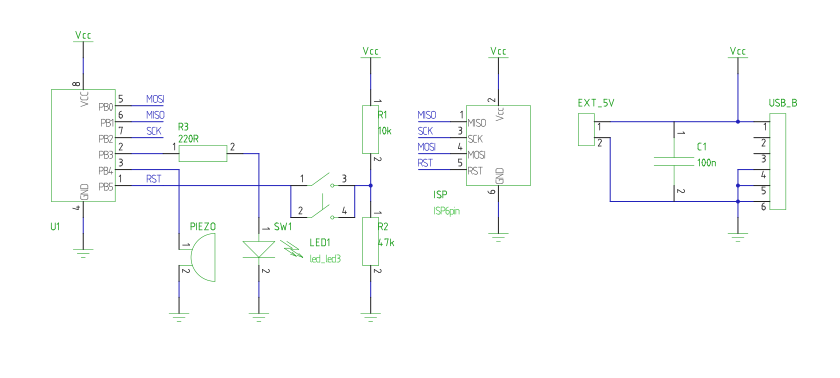

# STEM4ukraine-Patron

A simple PCB with the Ukrainian national anthem set off by pressing of the button and LED which displays Morse code!

An educational school STEM project demonstrating use of GPIO for detecting button presses with software debouncing, driving an LED with Morse code, and a talking point and reminder to learn about the dangers of mines with everyone's favorite dog, Patron.

Can you decode the Morse code?

The front of the PCB:

The rear of the prototype PCB:

The schematic:

